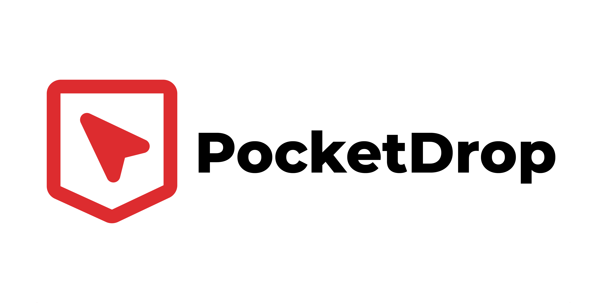

  
  <h3><em>Drag. Drop. Effortlessly.</em></h3>

 

⭐️ If you like the project, leave a star ⭐️

# ℹ️ About

PocketDrop is a free and open-source drag and drop utility for Windows.

> [!IMPORTANT]
> * PocketDrop is currently in active development. The app is functional but may contain bugs or incomplete features. If you encounter any issues, please report them in the Issues tab.
> #### Liability:
> * This application is provided "AS IS" and used at your own risk. The developers and contributors are not liable for any claims, damages, or other liability — including any legal consequences — arising from or in connection with the software or its use. All responsibility for outcomes rests entirely with the user.

# 🛠️ Technologies

- `C# / .NET10`
- `Windows Presentation Foundation (WPF)`
- `WindowsAPICodePack-Shell`
- `Sentry`
- `Inno Setup`

# ✨ Features

Here's what you can do with PocketDrop:

- **Shake to summon:** Wiggle your mouse while dragging a file to summon a Pocket.
- **Works with what you drag:** Add folders, documents, images, links, text snippets.
- **Manage your files:** Preview, rename, reorder, or remove files directly on the Pocket without breaking your flow.
- **Built-in file actions:** Resize images, extract text, create ZIP archives, and handle common tasks without leaving the Pocket.
- **Advanced controls:** Use keyboard shortcuts, Command Bar, custom actions, and scripts to move faster through repetitive work.

## 🗃️ Supported file formats:

PocketDrop is compatible with these popular file formats:

| Format | Support |
| --- | --- |
| Text formats | .txt / .rtf / .docx / .csv / .doc / .wps / .wpd / .msg |
| Image formats | .jpg / .png / .webp / .gif / .tif / .bmp / .eps |
| Audio formats | .mp3 / .wma / .snd / .wav / .ra / .au / .aac |
| Video formats | .mp4 / .3gp / .avi / .mpg / .mov / .wmv |
| Program formats | .c / .cpp / .java / .py / .js / .ts / .cs / .swift / .dta / .pl / .sh / .bat / .com / .exe / .msi |
| Compress / Archive formats | .rar / .zip / .hqx / .arj / .tar / .arc / .sit / .gz / .z |
| Web Page formats | .html / .htm / .xhtml / .asp / .css / .aspx / .rss |
| Folders | ✅ |

> [!NOTE]
> PocketDrop should be compatible with most file formats. If you encounter an issue with a specific format, please let me know in the Issues tab.

## ⌨️ Keyboard Shortcuts:

Speed up your workflow with these shortcuts (customizable in Settings):

| Action | Shortcut |
| --- | --- |
| Create a new Pocket | `Win + Shift + Z` |
| Create a new Pocket from the clipboard | `Win + Shift + X` |

# 🎯 How can it be improved?
- [ ] \(Optional) Open a followup issue

# 💾 Download

You can check out the [latest release](https://github.com/naofunyan/PocketDrop/releases) to download the latest version of PocketDrop.

- `x64` is for 64-bit Windows.
- `x86` is for 32-bit Windows.
- `arm64` is for 64-bit ARM Windows.

Run the installer (`PocketDrop_Setup.exe`) and follow the on-screen steps to install PocketDrop.

# License and Trademarks

**Code:**
The source code of PocketDrop is licensed under the [GNU General Public License v3.0](LICENSE). You are free to download, modify, and distribute the code under the terms of this license.

**Branding (Trademarks):**
The name "PocketDrop", the PocketDrop logo, and related brand assets are the exclusive property of Naofunyan. The GPLv3 license **does not** grant you the right to use these branding elements. 

If you choose to modify and distribute this software, you must remove the PocketDrop logo and use a different name for your project to avoid confusing users.
